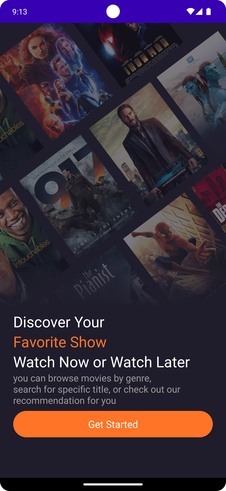

# MovieInfo


## Overview
MovieInfo is your one-stop app to explore, discover, and stay updated on all things movies. Whether you're looking for details about the latest blockbusters, upcoming releases, or trending films, MovieInfo has you covered. The app also lets you watch trailers, save favorite movies, and manage your profile, all in one place.
---
## Workflow


## Features

### 1. Welcome and Authentication
- **Welcome Screen**: The app starts with a welcome screen that guides users to log in or sign up.
- **Login/Signup**: Users can log in to their existing accounts or create new ones. Firebase handles authentication.

### 2. Home Page
- **Slider View**: Displays featured or trending movies in a sliding view.
- **Top Movies**: Lists top-rated films.
- **Upcoming Movies**: Shows upcoming releases.
- **Navigation Bar**: Provides easy access to different sections of the app.

### 3. Movie Details
- **Details View**: Displays comprehensive movie information including release date, genre, description, and IMDb rating.
- **Watch Now**: Button to watch the movie or trailer immediately.
- **Watch Trailer on YouTube**: Option to view the trailer directly on YouTube.

### 4. Search and Explore
- **Search View**: Allows users to search for movies.
- **See All**: View a complete list of all movies and search for specific titles.

### 5. Favorites
- **Favorites Page**: View and manage a list of favorite movies.

### 6. Profile Management
- **Profile Page**: Displays and allows users to manage account information, settings, and notifications.

## Data Management
- **Firebase Integration**: Fetches movie data from Firebase JSON files to populate various sections of the app.
---
## Technologies Used

### 1. Kotlin
- **Language**: Kotlin is used for the app's development, providing a modern, expressive, and type-safe programming language for Android.

### 2. XML
- **Layouts**: XML is used to define the app's user interface layouts and views, ensuring a clean and organized structure.

### 3. Material UI
- **Design System**: Material UI is used to implement Google's Material Design principles, offering a consistent and visually appealing design across the app.

### 4. Coroutines
- **Asynchronous Programming**: Kotlin Coroutines are used for handling asynchronous tasks, making the code more readable and manageable.

### 5. Retrofit
- **Networking**: Retrofit is employed for making HTTP requests and handling responses, simplifying network operations.

### 6. OkHttp
- **HTTP Client**: OkHttp is used in conjunction with Retrofit for efficient network requests, providing features like caching, retries, and logging.

### 7. Firebase
- **Backend Services**: Firebase provides real-time database functionality, user authentication, and data storage, enabling seamless integration and management of app data.

### 8. Glide
- **Image Loading**: Glide is utilized for loading and displaying images efficiently, handling image caching and smooth scrolling.

### 9. View Binding
- **UI Binding**: View Binding simplifies the process of accessing views within the app, reducing boilerplate code and enhancing type safety.

--- 
## Video Demo

[](https://youtu.be/BSdMb3pwEVU)


---
### Video Demo
[](path_to_video_demo)

---
## 📷 App Features

|             |    |        |
|:------------------------------------------------------------------------------:|:-------------------------------------------------------------------------------:|:-------------------------------------------------------------------:|
|                                  SplashScreen                                  | introScreen.png                                                                 |                             Login Page                              |

|                            |       |  |
|:--------------------------------------------------------------------------------------------------------:|:-----------------------------------------------------------------------------:|:---------------------------------------------------------------:|
|                                               Sign Up Page                                               |                                   Home Page                                   |                          view Deatils                           |

|        |  |    |
|:------------------------------------------------------------------------------------------:|:----------------------------------------------------------------------------------:|:-----------------------------------------------------------------------------------:|
|                                        Search View                                         |                                   Favorite page                                    |                                    Profile Page                                     |
---
## Installation

1. **Clone the Repository**:
   - Open your terminal or command prompt.
   - Run the following command to clone the project:
     ```bash
     git clone https://github.com/anshumanbehera27/MovieInfo_Android-App.git
     ```

2. **Open in Android Studio**:
   - Launch Android Studio.
   - Select `File` > `Open`, then navigate to and open the `MovieInfo` folder.

3. **Build and Run**:
   - Click `Sync Now` if prompted to sync Gradle.
   - Click `Run` (the green triangle) to build and run the app on a connected device or emulator.
